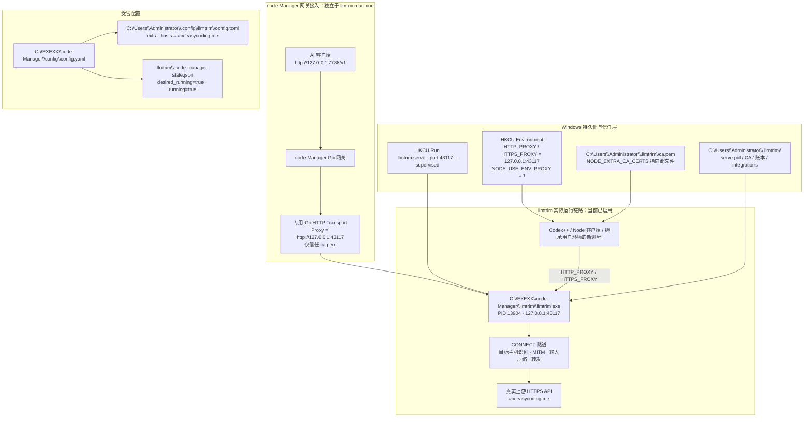

# llmtrim 部署与运行总结

> 核验日期：2026-09-01。本文记录本机首次成功部署后的运行拓扑、配置归属、健康证据和维护边界。文中不记录上游 API Key。

## 一、当前结论

llmtrim 已成功部署并正在实际处理请求。实际运行文件是：

```text
C:\EXEXX\code-Manager\llmtrim\llmtrim.exe
```

它当前以 daemon 方式监听 `127.0.0.1:43117`，原生状态报告为 `running=true`、`health=healthy`、`port_accepting=true`、`restarts=0`。本次核验时版本为 `0.13.2`，PID 为 `13904`。

注意：这是一份已经部署在 `C:\EXEXX\code-Manager` 的运行实例；不是 `C:\EXEXX\edit` 目录内的源码工作区实例。两者的路径和配置必须分开理解。

## 二、全链路导图



## 三、已核验的运行证据

| 项目 | 本次核验结果 | 含义 |
|---|---|---|
| 实际可执行文件 | `C:\EXEXX\code-Manager\llmtrim\llmtrim.exe` | 已部署的受管安装目录 |
| 版本 | `0.13.2` | 当前运行二进制与状态一致 |
| daemon | PID `13904`，端口 `43117` | 进程与监听端口均存在 |
| 原生健康检查 | `healthy`，`port_accepting=true` | 不只是进程残留，端口正在接受连接 |
| code-Manager 状态账本 | `desired_running=true`、`running=true` | 受管实例要求并记录为运行中 |
| 自启动 | 已注册 `llmtrim serve --port 43117 --supervised --hide-console` | 登录后可恢复 daemon |
| 请求总数 | `557` | 已有真实请求通过压缩器 |
| 输入压缩 | `12,616,658 -> 8,365,320` tokens | 本次统计节省 `4,251,338` tokens，约 `33.70%` |
| 平均额外延迟 | `49.16 ms` | 压缩代理的平均附加开销 |
| 主力模型 | `gpt-5.6-terra`，`548` 次请求 | 该模型缩减约 `33.75%` |

上述请求计数与缩减数据来自 `llmtrim.exe status --json`。它们证明 llmtrim 不只是启动并监听端口，而是正在接收和压缩真实流量。

## 四、配置分层与职责

### 1. 部署实例配置

`C:\EXEXX\code-Manager\config\config.yaml` 是当前运行实例的网关配置。已确认的非敏感字段如下：

```yaml
listen_address: "127.0.0.1:7788"
upstream_base_url: "https://api.easycoding.me/v1"
outbound_proxy: ""
llmtrim_path: "C:\\EXEXX\\code-Manager\\llmtrim\\llmtrim.exe"
startup_enabled: false
background_start: false
retry_enabled: true
retry_count: "5"
retry_interval_seconds: "1"
```

- `listen_address` 是 code-Manager 本地 `/v1` 网关地址，不是 llmtrim 端口。
- `llmtrim_path` 必须指向实际运行的 `llmtrim.exe`；程序使用完整路径匹配进程，避免把别的同名程序误认成健康实例。
- llmtrim 运行时，`outbound_proxy` 与 code-Manager 的基线 H3/H2 客户端不参与实际请求；llmtrim 停止后才恢复基线路由。

### 2. llmtrim 受管主机配置

`C:\Users\Administrator\.config\llmtrim\config.toml` 当前内容为：

```toml
# Managed by code-Manager.
extra_hosts = ["api.easycoding.me"]
```

同目录中的 `.code-manager-managed` 表示这是 code-Manager 拥有的配置目录。保存上游 Base URL 时，程序只提取主机名并重写 `extra_hosts`，不会把上游 API Key 写入该 TOML。

改变上游主机后，必须先停止再启动 llmtrim，让 daemon 重新读取配置并重建该主机的本地 CA。

### 3. 用户级运行状态与环境

`C:\Users\Administrator\.llmtrim\` 是同一 Windows 用户共享的 llmtrim 状态目录，当前包含：

- `serve.pid`：记录 PID、端口、版本和启动时间。
- `ca.pem`、`ca.key`、`ca.hosts`：本地 HTTPS MITM 所需的 CA 与受支持主机记录。
- `integrations.json`：llmtrim 原生集成状态。
- `serve.log`：daemon 日志文件。

llmtrim setup 已写入以下用户环境：

```text
HTTP_PROXY=http://127.0.0.1:43117
HTTPS_PROXY=http://127.0.0.1:43117
NODE_EXTRA_CA_CERTS=C:\Users\Administrator\.llmtrim\ca.pem
NODE_USE_ENV_PROXY=1
```

`NO_PROXY` 会排除 localhost、私网地址和 `.local` 域名，因此这些目标不会经 llmtrim。

## 五、真实请求如何经过 llmtrim

### 客户端直接继承环境的链路

1. 新启动的 Node/Codex++ 等客户端读取当前用户环境变量。
2. HTTPS 请求通过 `HTTP_PROXY` 或 `HTTPS_PROXY` 指向 `127.0.0.1:43117`。
3. llmtrim 为配置允许的 LLM API 主机建立本地 MITM 会话，压缩请求内容后转发真实 HTTPS 上游。
4. Node 使用 `NODE_EXTRA_CA_CERTS` 信任 `ca.pem`，从而接受 llmtrim 签发的本地连接证书。

### 经 code-Manager `/v1` 网关的链路

1. 客户端请求 `http://127.0.0.1:7788/v1/...`。
2. code-Manager 校验本地访问密钥，保留真实上游 URL、路径、请求头和请求体。
3. 检测到 llmtrim 后，code-Manager 创建专用 Go HTTP Transport：`Proxy=http://127.0.0.1:43117`，并仅加载 `%USERPROFILE%\.llmtrim\ca.pem` 为信任根。
4. 对真实上游 HTTPS URL 建立 CONNECT 隧道；llmtrim 在隧道中识别目标主机、MITM、压缩并转发。
5. 上游响应原样流回 code-Manager，再流回调用方。

这不是“把转换 JSON POST 给 43117”的协议。43117 是正向 HTTP(S) 代理，真实上游 URL 始终由 code-Manager 控制。

如果 llmtrim、CA、CONNECT 或 TLS 任一环节失败，code-Manager 会返回错误而不回退直连，避免出现“看似启用、实际绕过压缩器”的情况。

## 六、启动、停止、安装与卸载

### 启动

- 网页“启动”调用 `llmtrim.exe setup`。
- `setup` 会恢复用户环境、CA、自启动并启动 daemon。
- code-Manager 只有在“配置路径的 llmtrim.exe 进程存在”和“43117 正在监听”同时成立时，才报告运行中。
- 成功后写入 `llmtrim\.code-manager-state.json` 的 `desired_running=true`、`running=true`。

### 停止

- 先执行 `autostart --off`，再停止 daemon 和 tray。
- 关闭 code-Manager 的专用 llmtrim 连接池。
- 清理本程序写入的用户自启动和相关环境变量。
- 明确停止后，code-Manager 才会恢复基线 H3/H2 或 `outbound_proxy` 路由。

### 安装与卸载

- 安装从 GitHub Release 下载 Windows ZIP，校验 SHA-256，安全解压并整体替换受管 `llmtrim` 目录。
- 安装过程中会执行 `setup`、校验环境、等待 daemon 监听；任何关键步骤失败都会回滚，避免半安装状态。
- 卸载只删除 code-Manager 能证明归属的安装目录和配置；它会停止进程、清理自启动、环境、CA、状态目录和带标记的受管 TOML 目录。

## 七、当前源码工作区的差异

当前工作区为 `C:\EXEXX\edit`，其中 `config\config.yaml` 的 `llmtrim_path` 指向：

```text
C:\EXEXX\edit\llmtrim\llmtrim.exe
```

该文件当前不存在。并且 `127.0.0.1:57321` 的监听进程是 `codex-plus-plus.exe`，不是本工作区编译或运行的 `code-Manager.exe`。

因此应区分以下结论：

- llmtrim 全局 daemon 和实际压缩链路：已经成功。
- `C:\EXEXX\code-Manager` 的受管部署实例：已经成功并持久化。
- `C:\EXEXX\edit` 当前源码工作区的 code-Manager 网关到 llmtrim 的运行实例：尚未与已部署实例对齐，不能仅凭 daemon 正常就判定为已启用。

在未明确迁移前，不要把 `C:\EXEXX\edit` 的失效路径当作当前运行实例的管理路径。

## 八、证书信任的待观察项

当前 Node/Codex 链路所需的 `ca.pem`、`NODE_EXTRA_CA_CERTS` 和代理环境均已存在，且真实请求已成功通过。另一方面，本次只读查询没有在当前用户 Root 证书库中找到 Subject、Issuer 或 FriendlyName 含 `llmtrim` 的证书项。

这不会影响目前依赖 `NODE_EXTRA_CA_CERTS` 的 Node/Codex 请求，但某些只信任 Windows 证书库的客户端将来若出现 HTTPS 证书错误，应优先检查本地根证书并运行：

```powershell
& 'C:\EXEXX\code-Manager\llmtrim\llmtrim.exe' doctor
```

需要修复时再由人工决定是否运行 `doctor --fix`，不要在排查阶段直接执行修复命令。

## 九、从零到部署成功的实际步骤

以下步骤面向首次部署。以 `code-Manager.exe` 所在目录作为唯一部署根目录；本文中的 `C:\EXEXX\code-Manager` 只是本机本次成功实例，不能把 `C:\EXEXX\edit` 源码目录中的失效路径直接用于部署。

1. **准备上游配置。** 启动实际部署目录中的 `code-Manager.exe`，在网页“网关配置”填写有效的 HTTPS 上游 Base URL 和上游 API Key，保存。确认 Base URL 是实际要访问的 API 根地址；保存后会自动同步受管 `extra_hosts`，不会把 API Key 写入 llmtrim TOML。
2. **确认工具互不影响。** llmtrim 可与 RTK、snip 独立运行；它不参与 RTK/snip 的互斥。首次安装前不要手工启动另一份未受管的 llmtrim，也不要让其它程序占用 `43117`。
3. **安装 llmtrim。** 打开网页 `llmtrim` 页签，先“加载”版本列表，选择 Windows 对应版本并点击“安装”。安装会下载 ZIP、校验 SHA-256、写入部署目录下的 `llmtrim` 文件夹，再执行 `setup`。
4. **确认 setup 完成。** 页面应同时显示已安装、已配置和运行中，并显示 `127.0.0.1:43117` 与 PID。此时 `setup` 已写入用户代理环境、Node CA 路径、登录自启动、`%USERPROFILE%\.llmtrim` 状态文件并启动 daemon。
5. **单独启动网关代理。** 顶部“启动代理”与 llmtrim“启动”是两件事。llmtrim 已运行后，还要点击顶部“启动代理”，让 code-Manager 开始监听 `config.yaml` 中的 `/v1` 地址并预热上游连接；仅启动 llmtrim 时，客户端访问网关仍会得到 503。
6. **配置调用方。** 将需要经 code-Manager 的 OpenAI 兼容客户端 Base URL 设置为 `http://127.0.0.1:<listen_address 的端口>/v1`，并按需要设置本地网关 API Key。不要把 `43117` 当作 OpenAI API 地址；它是 llmtrim 的正向 HTTP(S) 代理端口。
7. **完成一次真实请求。** 发起正常 API 请求后，使用“显示日志”打开 `llmtrim.exe status`，应看到最近请求、请求数和缩减比例变化。仅看到端口监听还不算端到端成功。
8. **变更上游主机时重启 daemon。** 修改 Base URL 的主机名后，先停止 llmtrim，再启动 llmtrim，最后确认顶部网关仍处于运行中。这样 llmtrim 才会读取新的 `extra_hosts` 并重建该主机的 CA。
9. **停止或迁移前先按逆序处理。** 先停止顶部代理，再停止 llmtrim；需要删除时使用同一部署实例的“删除”。不要用 `edit` 源码工作区中已经失效的 `llmtrim_path` 对当前部署实例执行维护操作。

## 十、日常只读验收命令

```powershell
& 'C:\EXEXX\code-Manager\llmtrim\llmtrim.exe' status --json

Get-NetTCPConnection -LocalPort 43117 -State Listen |
    Select-Object LocalAddress, LocalPort, OwningProcess

Get-CimInstance Win32_Process -Filter 'ProcessId=13904' |
    Select-Object ProcessId, Name, ExecutablePath, CommandLine
```

阅读和修改 llmtrim 功能时，优先查看：

- `README.txt` 的“llmtrim 部署手册”。
- `main.go` 中 `newLLMTrimProxyClient`、`selectUpstreamClient`、`forward`、`queryLLMTrimRunning`。
- `llmtrim_install.go` 中安装、setup、环境校验、停止和卸载逻辑。
- `llmtrim_config.go` 中 `extra_hosts` 的原子写入、回滚和受管目录归属校验。
