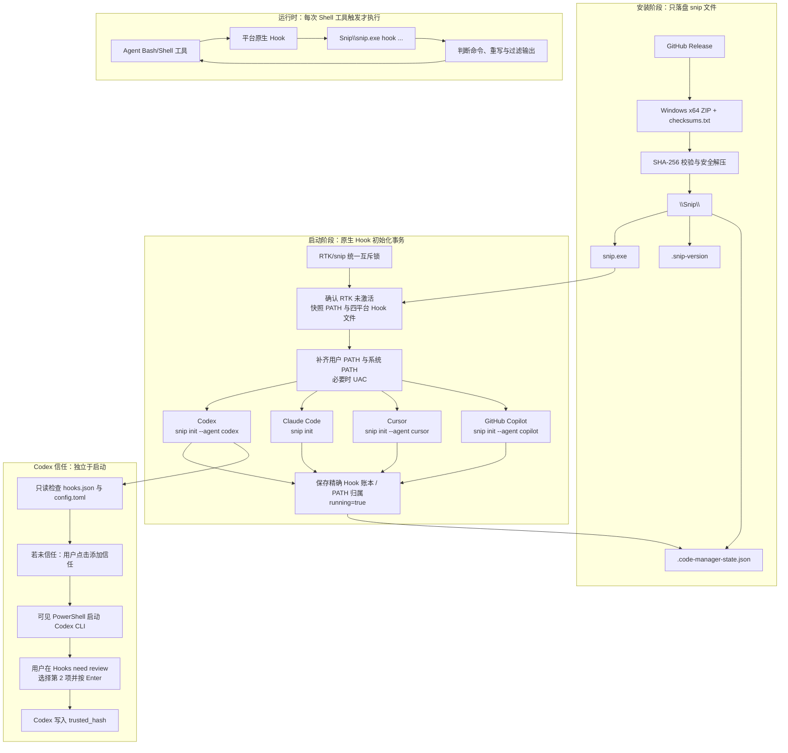

# snip 部署与运行总结

> 文档更新：2026-09-03；当前部署实况最后核验：2026-09-01。本文记录 snip 的原生 Hook 接入、Codex 信任边界、当前真实部署状态、配置归属和维护边界。不记录任何用户密钥或信任哈希。

## 一、当前结论

snip 当前没有启用。它不是 daemon，而是在 Agent 的原生 Hook 被触发时短暂运行的命令输出过滤器。

本次核验结果：

```text
C:\EXEXX\edit\Snip\snip.exe：存在，版本 v0.25.0
C:\EXEXX\edit\Snip\.code-manager-state.json：desired_running=false，running=false
C:\EXEXX\code-Manager\Snip：不存在
当前没有 snip.exe 进程
当前未检测到任何 Agent 配置中的 snip Hook 命令
```

Codex 用户目录中虽存在 `hooks.json`，但其中没有 `snip.exe hook codex`；`config.toml` 中也没有可用于该 Snip Hook 的 `trusted_hash`。这说明当前没有待信任的 Snip Codex Hook，也不存在“Snip 已接入但未授权”的半启动状态。

兼容旧版状态时，`owned_agents` 不再直接作为删除依据。只有该平台恰好能定位到一条仍指向对应发布目录绝对 `snip.exe` 的 Hook，才会恢复为新的精确归属；其余旧记录会在页面显示“清理”时安全清除，不会据此删除手工 Hook。

## 二、全链路导图



## 三、snip 的职责边界

snip 负责命令输出过滤，不负责网络请求压缩，也不是 RTK 的后台替代品。`snip init` 只把原生 Hook 登记到各 Agent 的用户级配置；实际判断、命令重写和输出过滤由后续触发的 `snip.exe hook ...` 完成。

code-Manager 负责下载、校验、PATH、四平台初始化事务、状态归属、停止、卸载和 Codex 信任状态展示。它不会实现另一套 snip 过滤逻辑，也不会自动替用户确认 Codex 的 Hook 审核。

## 四、四平台原生接入映射

| 平台 | 检测目录与目录存在后调用的官方命令 | Hook 命令 | 原生目标文件与事件 |
|---|---|---|---|
| Codex | `%USERPROFILE%\\.codex`；`snip.exe init --agent codex` | `snip.exe hook codex` | `hooks.json` 的 `PreToolUse`，匹配 `Bash` |
| Claude Code | `%CLAUDE_CONFIG_DIR%`；未设置时 `%USERPROFILE%\\.claude`；`snip.exe init` | `snip.exe hook` | `settings.json` 的 `PreToolUse`，匹配 `Bash` |
| Cursor | `%USERPROFILE%\\.cursor`；`snip.exe init --agent cursor` | `snip.exe hook` | `hooks.json` 的 `beforeShellExecution`，matcher 为 `.*` |
| GitHub Copilot | `%USERPROFILE%\.copilot`；`snip.exe init --agent copilot` | `snip.exe hook copilot` | `hooks\snip.json` 的 `preToolUse`，处理 Bash 命令字段 |

code-Manager 仅在对应用户级目录已经存在时调用初始化。与 RTK 不同，snip 首次初始化可以让 snip 官方 CLI 创建缺失的 Hook 文件；已经存在的非受管 Snip Hook 不会传给上游 `init`，避免被其宽松匹配覆盖或被本程序接管。

## 五、安装、启动、停止、卸载

### 1. 安装

安装从 Release 下载 Windows x64 ZIP 与 `checksums.txt`，校验 SHA-256 后整体替换名称精确为 `Snip` 的专属目录，并写入 `.snip-version` 和初始停止状态。安装阶段不会写 PATH，也不会初始化 Agent Hook。安装或版本切换要求账本已停止；`running` 或 `desired_running` 时后端返回 HTTP 409，避免运行中替换 Hook 指向的 EXE。

### 2. 启动

启动是一个与 RTK 互斥的事务：

1. 获取统一锁，若 RTK 已激活则拒绝启动。
2. 确认 `Snip\snip.exe` 存在，读取状态账本；仅在本次需要新增或修复 Codex Hook 时，才确认可定位的
   Codex CLI 不低于 `0.131.0`，否则该原生 `PreToolUse` Hook 不可用。已有非受管 Codex Hook 不会阻断
   其它平台接入。
3. 按 Snip 官方目录规则扫描已存在的 Codex、Claude Code、Cursor、Copilot 用户目录，并快照其目标 Hook 文件。
   若本次需要初始化 Claude Code 或 Cursor，而 code-Manager 同级 `Snip\snip.exe` 的绝对路径含空格，
   Snip 0.25.0 的官方初始化命令无法可靠引用该路径；事务会在写 PATH 或 Hook 前失败，必须将
   code-Manager.exe 移到不含空格的目录后重试。
4. 强制补齐用户 PATH 和系统 PATH；需要时请求 UAC。双范围 PATH 是本项目必要的部署配置。
5. 只在目标事件中不存在任何 Snip 命令时执行对应官方 `snip init`。运行中受管 Hook 缺失也必须满足这一条件；
   已被改写、移动、替换或无法解析的 Hook 会显示待处理，绝不覆盖或接管手工 Snip Hook。
6. 从初始化前后快照中唯一定位新增处理器，记录目标文件、事件、组/处理器下标、Hook 组上下文指纹、完整 JSON 指纹和实际命令到
   `metadata.snip_ownership_v1`。同一平台因 `CLAUDE_CONFIG_DIR` 等目录切换而出现多个目标文件时分别记录，再记录 PATH 和
   `activation_recorded=true`，最后写入
   `running=true`、`desired_running=true`。

任意 `init`、新增 Hook 定位、PATH 或状态写入失败都会恢复 Hook 文件快照并撤销本次新增 PATH，不能留下部分平台已接入却显示“运行中”的状态。已运行时再次点击启动会复查新增平台、缺失 Hook、精确受管处理器和两类 PATH，不会直接跳过。已停止账本中的历史归属不会用来覆盖后来出现的手工 Hook；若仍有可清理的受管状态，页面显示“清理”。

### 3. 停止

停止优先读取 `metadata.snip_ownership_v1`，只在目标 JSON 文件中删除目标文件、事件、组/处理器位置、Hook 组上下文、
完整处理器指纹和命令都仍匹配的那一条 Hook，再按归属移除用户/系统 PATH，并复查注册表结果。不会调用上游宽匹配的
`snip init --uninstall`；旧 `owned_agents` 仅在可唯一恢复一条旧 Hook 时参与迁移。处理器被人工移动或重新排序时保留
`attention` 并要求手工确认；改写或删除后无法再证明归属的内容会保留，不删除手工 Hook 或手工 PATH。

停止不会修改 Codex `config.toml` 的 Hook 开关，也不会删除 `trusted_hash`。信任记录属于 Codex 原生安全决策，而不是 snip 生命周期状态。

### 4. 卸载

卸载要求 snip 已停止且 RTK 未运行。程序先做与停止相同的 Hook/PATH 清理，再只删除名称精确为 `Snip` 的专属目录。平台卸载失败时保留 `attention`，不会伪装成“已删除”。

## 六、Codex 信任是独立人工步骤

Snip Hook 文件已创建，不等于 Codex 已允许执行该 Hook。启动 snip 不会自动打开审核窗口，也不会自动改写 `trusted_hash`。

当 Codex Hook 存在且未信任时，用户在页面点击“添加信任”后，code-Manager 才会：

1. 只读检查固定的 `%USERPROFILE%\.codex\hooks.json` 与同目录 `config.toml`；Snip 官方 Codex 初始化不使用 `CODEX_HOME`。
2. 动态定位 `codex.exe`、`codex.cmd` 或 `codex`，优先 PATH，找不到时从
   `%LOCALAPPDATA%\OpenAI\Codex\bin` 选择最近版本。
3. 打开可见 PowerShell，以 code-Manager EXE 所在目录作为 `codex -C` 的项目目录。
4. 用户在 `Hooks need review` 界面选择第 2 项 `Trust all and continue`，再按 Enter（回车）。
5. Codex 自己写入对应 Hook 的 `trusted_hash`；页面会将其与当前规范化 Hook 身份精确比对，回到页面刷新后才显示“已信任”。

不要输入 `/hook`、`/hooks`、数字 `2` 或 `t` 来替代菜单操作；也不要让代码模拟按键或直接写入信任账本。若 Codex 配置明确设定 `hooks=false` 或 `codex_hooks=false`，必须由用户自行开启，code-Manager 只提示而不覆盖。

## 七、状态账本与当前实际状态

`Snip\.code-manager-state.json` 只记录 code-Manager 的归属和期望状态：

| 字段 | 含义 |
|---|---|
| `desired_running` | 下次 code-Manager 启动是否尝试恢复 snip |
| `running` | 最近一次 Hook 接入事务是否完整成功，不代表存在后台进程 |
| `user_path` / `system_path` | PATH 是否由本程序写入并应由本程序清理 |
| `metadata.snip_ownership_v1` | 主归属账本；逐条记录本程序新增 Hook 的目标文件、事件、组/处理器下标、Hook 组上下文、完整 JSON 指纹和命令；同一平台可记录多个不同目标文件 |
| `owned_agents` | 由精确账本派生的兼容摘要；旧版状态仅用于安全恢复，不再作为删除依据 |
| `metadata.activation_recorded` | 区分原有配置与本程序本次接入 |
| `metadata.trust_notice` | 供页面显示的 Codex 信任说明 |
| `metadata.last_error` | 失败诊断；存在时页面显示 `attention` |

停止状态仍保存精确账本、受管 PATH 或无法确认的旧归属时，页面会显示 `attention` 与“清理”；清理只处理可证明归属的内容，未知或手工 Hook 会保留。

## 八、当前目录差异

| 位置 | 当前状态 | 说明 |
|---|---|---|
| `C:\EXEXX\edit\Snip` | 已安装、停止 | 当前仅能看到的 snip 安装目录，版本 `v0.25.0` |
| `C:\EXEXX\code-Manager\Snip` | 不存在 | 实际部署目录中尚无 snip 受管安装 |
| Codex `hooks.json` | 存在但无 snip 命令 | 不需要进行 Snip 信任审核 |
| Codex `config.toml` | 未发现 Snip 对应 `trusted_hash` | 与“没有 Snip Hook”一致 |

因此当前 RTK 仍是唯一已激活的命令输出接入。若要启用 snip，必须先通过实际部署的 code-Manager 停止 RTK，再安装/启动 snip；不能在两个工具同时激活时手工绕过互斥状态。

## 九、从零到部署成功的实际步骤

以下步骤面向首次启用 snip。snip 与 RTK 互斥，且 Codex 信任是启动后的独立人工步骤；应使用实际部署目录中的 code-Manager，而不是仅修改 `C:\EXEXX\edit` 的源码状态文件。

1. **先停止 RTK。** 在网页确认 RTK 不再显示“运行中”，并处理任何冲突或 `attention`。仅关闭某个 Agent 或没有看到 `rtk.exe` 进程都不等于 RTK 已停止，必须让 code-Manager 完成 PATH 和接入清理。
2. **准备 Agent 用户目录。** snip 固定扫描 `%USERPROFILE%\.codex`、Cursor 的 `.cursor`、Copilot 的
   `.copilot`，Claude Code 使用 `%CLAUDE_CONFIG_DIR%`（未设置时 `.claude`）。至少应存在一个目录；
   目标 Hook 文件首次可以由 snip 官方 `init` 创建，不需要用户手工伪造 JSON。
3. **安装 snip。** 打开 snip 页签，加载版本列表，选择 Windows x64 版本并点击“安装”。安装只下载、校验 SHA-256、写入 `Snip\snip.exe` 和版本/停止状态，不会立即写 Hook 或 PATH。
4. **启动 snip。** 点击“启动”，接受需要出现的 UAC。code-Manager 会检查 RTK 互斥，快照所有当前 Agent Hook 文件，
   强制补齐用户/系统 PATH，并仅在目标事件没有任何 Snip 命令时执行对应官方 `snip init`；手工 Snip Hook 不会被覆盖。
5. **确认 Hook 接入成功。** 页面应显示 snip“运行中”，并列出实际修改的平台。此时 snip 仍没有后台进程是正常的；它只会在 Agent 执行 Bash/Shell 工具时被 Hook 调起。
6. **仅对 Codex 完成独立信任。** 若页面显示 Codex Hook“待人工确认”，点击“添加信任”。打开 PowerShell 后，等待 `Hooks need review`，选择第 2 项 `Trust all and continue`，再按 Enter（回车）。不要输入 `/hook`、`/hooks`、`2` 或 `t`，也不要手工写 `trusted_hash`。
7. **刷新并验收。** 返回网页刷新状态。Codex Hook 应显示“已信任”；其它平台只需确认自身 Hook 已配置。使用一次普通 Shell 工具请求即可观察 snip 的实际触发，无需执行长测试。
8. **日后新增平台。** 新安装的 Agent 先创建自己的用户目录，再回到同一 code-Manager 再次点击 snip“启动”。运行中的 snip
   会补齐新增目录、目标事件没有 Snip 命令的平台和双范围 PATH；受管处理器被改写或移动时会提示处理，不会覆盖手工 Hook。
9. **停止、升级、删除。** 先停止 snip，让 code-Manager 依精确账本清理目标文件、处理器位置、指纹和命令都匹配的 Hook 与 PATH；
   随后才可升级或删除 `Snip` 目录。停止不会删除 Codex 的 `trusted_hash`，这是预期行为。

## 十、日常只读验收

```powershell
& 'C:\EXEXX\edit\Snip\snip.exe' --version

$codexDir = Join-Path $env:USERPROFILE '.codex'
Get-Content -LiteralPath (Join-Path $codexDir 'hooks.json') -Encoding utf8 |
    Select-String -Pattern 'snip\.exe\s+hook\s+codex'

Get-Content -LiteralPath (Join-Path $codexDir 'config.toml') -Encoding utf8 |
    Select-String -Pattern 'hooks\.state|trusted_hash'

Get-CimInstance Win32_Process |
    Where-Object { $_.Name -eq 'snip.exe' } |
    Select-Object ProcessId, ExecutablePath, CommandLine
```

没有常驻 `snip.exe` 进程是正常现象。真正的验收点是状态账本、PATH、四个平台的原生 Hook 文件，以及 Codex Hook 存在时的独立信任状态。

## 十一、代码与文档入口

- `snip_install.go`：四平台规范表、状态接口、启动/停止/卸载事务和快照回滚。
- `snip_hook_config.go`：结构化 JSON Hook 解析、处理器位置/指纹检测和逐条精确删除。
- `snip_ownership.go`：精确 Hook 归属账本、旧 `owned_agents` 安全迁移、残留判定和清理边界。
- `snip_codex_hook.go`：Codex CLI 版本门槛、规范化 Hook 身份与 `trusted_hash` 比对。
- `snip_release.go`：Release 查询、Windows x64 资产、SHA-256 校验和安全替换。
- `snip_windows.go`：用户/系统 PATH、UAC、环境变量广播和精确清理。
- `snip_trust.go`：Codex Hook 信任只读检测、动态定位 Codex CLI、信任命令构造。
- `snip_trust_windows.go`：可见 PowerShell 审核窗口启动。
- `snip_install_test.go`：四平台目录、初始化、旧账本兼容、安装前停机与路径边界的聚焦测试。
- `snip_ownership_test.go`：四平台逐条账本、重复/移动 Hook、旧账本迁移、未受管状态和损坏配置保护测试。
- `snip_hook_config_test.go`：官方 Windows 转义 Hook 命令解析测试。
- `snip_codex_hook_test.go`：Codex 版本、规范化哈希和 Hook 改动后失信任的聚焦测试。
- `snip_trust_test.go`：固定 `.codex` 目录、路径规范化和忽略 `CODEX_HOME` 的聚焦测试。
- `README.txt` 的“snip 部署手册”：完整维护规则与故障排查。
