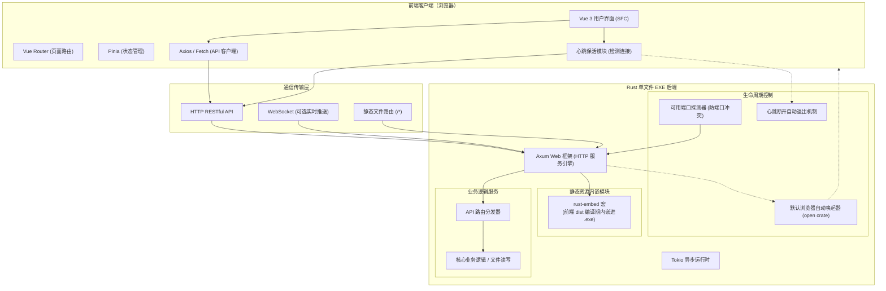
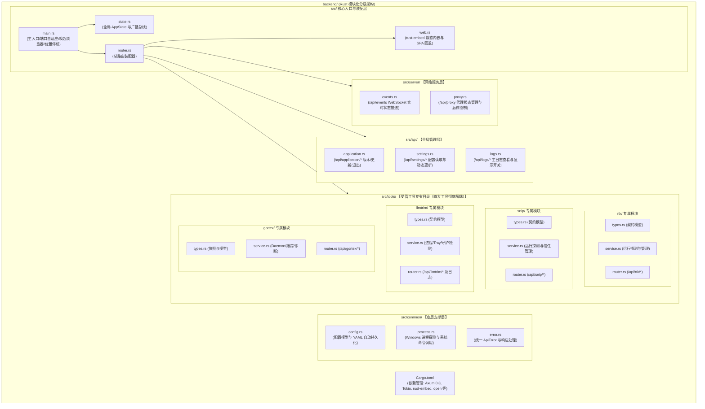
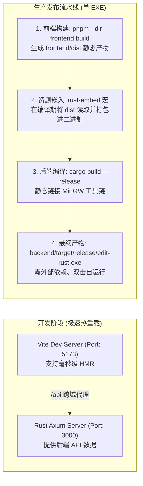
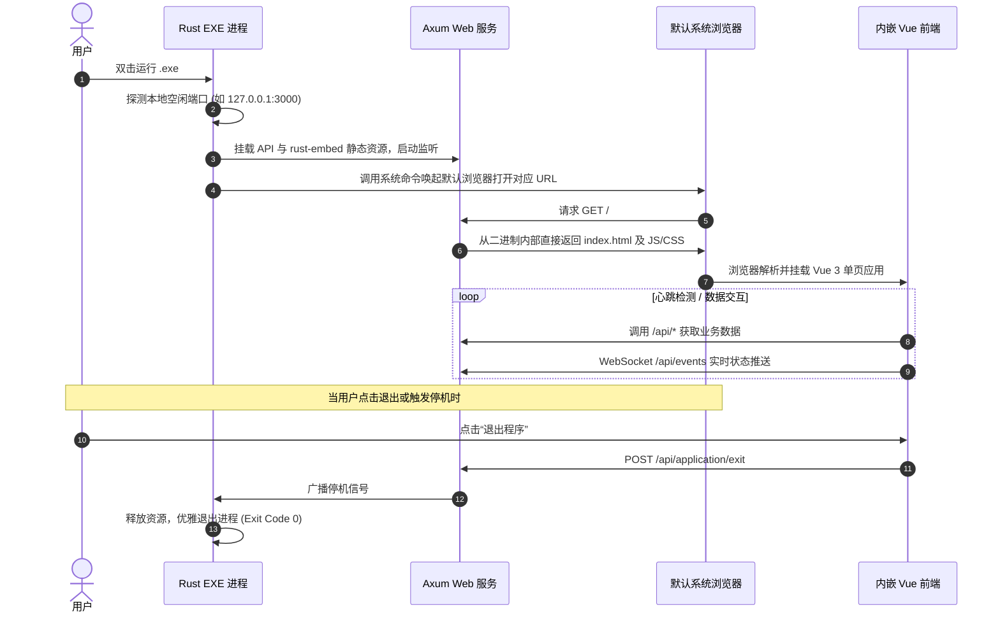

# 项目开发架构与导图指南

本项目为 **Vue 3 网页版前端 + Rust 后端** 的全栈架构，最终打包输出为**单个独立的 Windows `.exe` 可执行文件**。

---

## 1. 架构总览与交互导图

以下展示系统前端、网络通信与 Rust 单文件 EXE 后端整体分层交互：



---

## 2. 后端模块化分级架构导图

彻底解决平铺混乱的痛点，四大工具（RTK / Snip / LLMTrim / Gortex）与各系统层高内聚低耦合：



---

## 3. 开发与生产打包双轨流程图



---

## 4. EXE 启动与运行生命周期时序图



---

## 5. 项目完整目录规划

### 5.1 全局工程目录
```text
edit-rust/
├── frontend/                  # Vue 3 前端工程 (Vite + TS + Pinia)
├── backend/                   # Rust 后端工程 (Axum 0.8 + Tokio + rust-embed)
├── .gitignore                 # Git 忽略规则
└── 开发.md                    # 本架构指南与导图
```

### 5.2 后端分级细化目录
```text
backend/
├── Cargo.toml                    # 依赖管理（Axum 0.8、Tokio、rust-embed、serde、open 等）
└── src/
    ├── main.rs                   # 主程序入口：日志、端口自适应、浏览器自动唤起、优雅停机
    ├── state.rs                  # 全局状态 AppState 与广播总线
    ├── router.rs                 # 总路由装配器
    ├── web.rs                    # rust-embed 静态内嵌引擎（内嵌 frontend/dist）与 SPA 回退
    │
    ├── common/                   # 【底层支撑层】：跨模块公共基础
    │   ├── config.rs             # 配置模型与 YAML 自动持久化
    │   ├── process.rs            # Windows 进程探测与系统命令调用
    │   └── error.rs              # 统一 ApiError 异常处理
    │
    ├── server/                   # 【网络服务层】：长连接与网络通道
    │   ├── events.rs             # /api/events WebSocket 全双工实时状态推送
    │   └── proxy.rs              # /api/proxy 代理状态管理与启停控制
    │
    ├── api/                      # 【全局管理层】：基础管理接口
    │   ├── application.rs        # /api/application/* (版本识别、更新、安全退出)
    │   ├── settings.rs           # /api/settings/* (配置读取与动态更新保存)
    │   └── logs.rs               # /api/logs/* (主日志查看与显示开关)
    │
    └── tools/                    # 【受管工具专有目录（四大工具彻底解耦）】
        ├── rtk/                  # 1. RTK 模块：types.rs / service.rs / router.rs
        ├── snip/                 # 2. Snip 模块：types.rs / service.rs / router.rs
        ├── llmtrim/              # 3. LLMTrim 模块：types.rs / service.rs / router.rs
        └── gortex/               # 4. Gortex 模块：types.rs / service.rs / router.rs
```

---

## 6. 核心技术选型一览

| 模块 | 推荐技术 | 选型原因 |
| :--- | :--- | :--- |
| **前端框架** | Vue 3 + TypeScript | 响应式语法简洁，强类型加持，维护性高 |
| **构建工具** | Vite 6 | 极速热更新，构建体积精简 |
| **后端异步框架** | Axum 0.8 (Tokio) | 现代化高性能异步 Web 框架，官方团队长期维护 |
| **静态资源嵌入** | `rust-embed` | 将前端编译产物无感内嵌进可执行文件，无需外置资源 |
| **浏览器自动唤起** | `open` | 本地自启动后无需用户手动输入网址，自动弹出浏览器 |
| **全双工推送** | Axum WebSocket | `/api/events` 秒级将后端最新状态流式同步给前端 |

---

## 7. 常用指令清单

* **前端开发与构建**：
  * 开发启动：`cd frontend && pnpm dev`（端口 `5173`，自动代理至 `3000`）
  * 生产打包：`cd frontend && pnpm build`（输出至 `frontend/dist`）
* **后端开发与编译**：
  * 开发检查：`cd backend && cargo check`
  * 开发编译：`cd backend && cargo build`
  * 最终发布：`cd backend && cargo build --release`（输出至 `backend/target/release/edit-rust.exe`）
