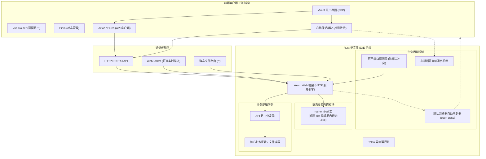
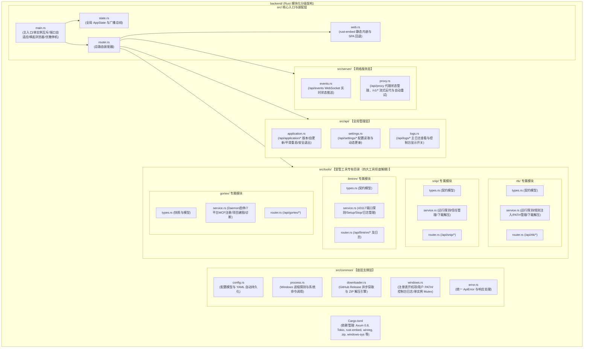
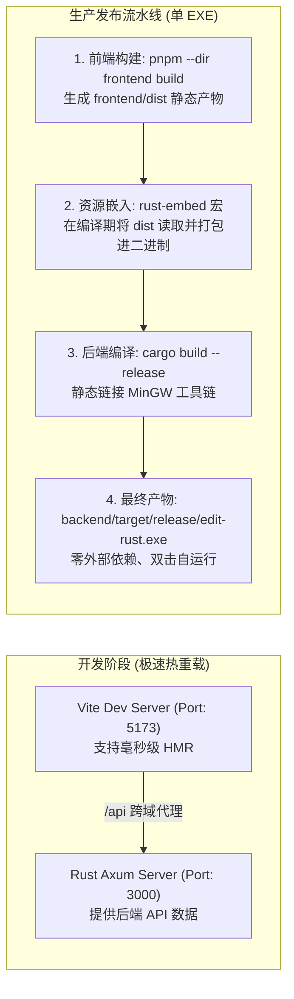
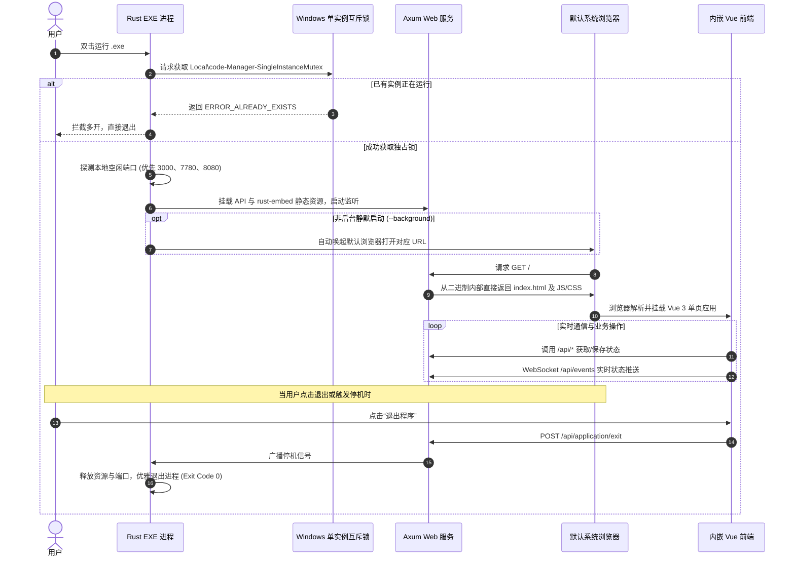

# 项目开发架构与导图指南

本项目为 **Vue 3 网页版前端 + Rust 后端** 的全栈架构，最终打包输出为**单个独立的 Windows `.exe` 可执行文件**。

---

## 1. 架构总览与交互导图

以下展示系统前端、网络通信与 Rust 单文件 EXE 后端整体分层交互：



---

## 2. 后端模块化分级架构导图

彻底解决平铺混乱的痛点，四大工具（RTK / Snip / LLMTrim / Gortex）与各系统层高内聚低耦合：



---

## 3. 开发与生产打包双轨流程图



---

## 4. EXE 启动与运行生命周期时序图



---

## 5. 项目完整目录规划

### 5.1 全局工程目录
```text
edit-rust/
├── frontend/                  # Vue 3 前端工程 (Vite + Pinia，已构建至 dist)
├── backend/                   # Rust 后端工程 (Axum 0.8 + Tokio + rust-embed)
│   ├── assets/                # 内嵌规则、提示词与图标资源
│   ├── src/                   # 模块化分级后端源码
│   └── Cargo.toml             # 依赖配置清单
├── 迁移.md                    # 32 项功能迁移验收手册 (100% 全部完成)
├── 开发.md                    # 本架构指南与导图
└── .gitignore                 # Git 忽略规则
```

### 5.2 后端分级细化目录
```text
backend/
├── Cargo.toml                    # 依赖管理（Axum 0.8、Tokio、rust-embed、winreg、zip 等）
├── assets/                       # 提示词与配置文件
│   ├── RTK-Codex-commands.md
│   ├── RTK-Codex-agent-instructions.md
│   ├── RTK-Claude-agent-instructions.md
│   ├── gortex提示词.md
│   └── gortex-opencode-plugin.js
└── src/
    ├── main.rs                   # 主程序入口：日志、单实例检测、端口自适应、浏览器唤起、优雅停机
    ├── state.rs                  # 全局状态 AppState 与广播总线
    ├── router.rs                 # 总路由装配器
    ├── web.rs                    # rust-embed 静态内嵌引擎（内嵌 frontend/dist）与 SPA 回退
    │
    ├── common/                   # 【底层支撑层】：跨模块公共基础
    │   ├── config.rs             # 配置模型与 YAML 自动持久化
    │   ├── process.rs            # Windows 进程探测与系统命令调用
    │   ├── downloader.rs         # GitHub Releases 获取与 ZIP 异步解压部署引擎
    │   ├── windows.rs            # 注册表开机项/PATH管理/控制台日志监视器/单实例Mutex
    │   └── error.rs              # 统一 ApiError 异常处理
    │
    ├── server/                   # 【网络服务层】：长连接与网络通道
    │   ├── events.rs             # /api/events WebSocket 全双工实时状态推送
    │   └── proxy.rs              # /api/proxy 代理启停控制、/v1/* 流式反代与自动重试
    │
    ├── api/                      # 【全局管理层】：基础管理接口
    │   ├── application.rs        # /api/application/* (版本识别、更新、平滑替换、安全退出)
    │   ├── settings.rs           # /api/settings/* (配置读取与动态更新保存)
    │   └── logs.rs               # /api/logs/* (主日志查看与独立控制台显示)
    │
    └── tools/                    # 【受管工具专有目录（四大工具彻底解耦）】
        ├── rtk/                  # 1. RTK 模块：types.rs / service.rs / router.rs
        ├── snip/                 # 2. Snip 模块：types.rs / service.rs / router.rs
        ├── llmtrim/              # 3. LLMTrim 模块：types.rs / service.rs / router.rs
        └── gortex/               # 4. Gortex 模块：types.rs / service.rs / router.rs
```

---

## 6. 核心技术选型一览

| 模块 | 推荐技术 | 选型原因 |
| :--- | :--- | :--- |
| **前端框架** | Vue 3 SFC (2644行全量迁移) | 与原项目完全一致，保证所有控件、卡片、响应行为 100% 像素级对齐 |
| **构建工具** | Vite 6 | 毫秒级打包输出静态文件至 `frontend/dist` |
| **后端异步框架** | Axum 0.8 (Tokio) | 现代化高性能异步 Web 框架，多线程高吞吐，官方长期维护 |
| **静态资源嵌入** | `rust-embed` | 将前端编译产物无感内嵌进单一 `.exe`，双击即可呈现完整 Web UI |
| **系统底层支持** | `winreg` + `windows-sys` | 直接读写 Windows 注册表与系统互斥体，无多余子进程开销 |
| **自动化部署引擎** | `reqwest` + `zip` | 异步多协程流式下载发布包，自动解压部署并注入规则提示词 |
| **反向代理与重试** | 流式反代 + 正则状态码引擎 | 完美转发 `/v1/*` 请求并注入密钥，遭遇特定状态码自动重试并支持 WebSocket |
| **浏览器自动唤起** | `open` | 启动后自动检测端口并唤起系统默认浏览器访问 |
| **全双工实时推送** | Axum WebSocket | `/api/events` 秒级将后端最新状态流式同步给前端 |

---

## 7. 常用指令清单

* **前端开发与构建**：
  * 开发启动：`cd frontend && pnpm dev`（端口 `5173`，自动代理至 `3000`）
  * 生产打包：`cd frontend && pnpm build`（输出至 `frontend/dist`）
* **后端开发与编译**：
  * 开发检查：`cd backend && cargo check`
  * 开发编译：`cd backend && cargo build`
  * 最终发布：`cd backend && cargo build --release`（输出至 `backend/target/release/edit-rust.exe`）
